 

+ Використовуючи Chocolatey встановили Terraform наступною командою:

```
choco install terraform
```

+ Створили новий проект в Google Cloud Platform під назвою "Lambert". Також творили новий сервіс акаунт. Ввели ім'я для нового акаунта "special-account", а наступні налаштування пропустили.

<p align="center">
  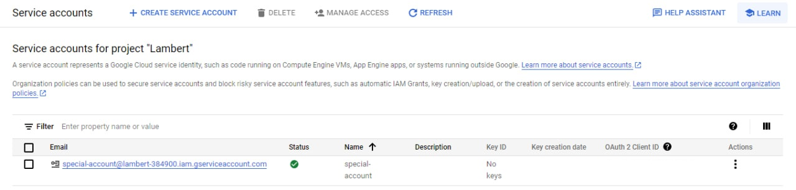
</p>


+ Далі було створено ключ типу JSON задля можливості Terraform взаємодіяти з Google Cloud. Виконали наступні дії: трикрапка в Actions сервіс акаунту → Manage keys → Add key → Create new key → JSON → Create. У відповідь почнеться завантаження файлу ключа. Одразу створюємо нову папку та зберігаємо туди цей файл.  
+ Надали роль Editor сервіс акаунку. Виконали наступні дії: перейшли до IAM & Admin/IAM → GRANT ACCESS → Role → Basic → Editor, та зберігли зміни.

<p align="center">
  
</p>
 
+ Наступним нашим кроком було створення файлу з назвою "main.tf" в папці з файлом ключа. Відкрили файл "main.tf" та записали наступний код:
```
terraform {
  required_providers {
    google = {
      source = "hashicorp/google"
      version = "4.51.0"
    }
  }
}

provider "google" {
  credentials = file(var.credentials_file)
  project = var.project
  region  = var.region
  zone    = var.zone
}

resource "google_compute_network" "drink_network" {
  name = "drink-network"
  auto_create_subnetworks = false
}

resource "google_compute_subnetwork" "food_subnetwork"{
  name = "food-subnetwork"
  region = var.subnet-region
  network = google_compute_network.drink_network.name
  ip_cidr_range = "10.0.0.0/16"
}

resource "google_compute_instance" "treat_instance" {
  name         = "treat-instance"
  machine_type = "e2-micro"
  tags = ["devops", "networking", "terraform", "knife", "cooking", "vegetables", "fruits" ]
  
  boot_disk {
    initialize_params {
      image = "debian-cloud/debian-11"
    }
  }

  network_interface {
    network = google_compute_network.drink_network.name
    subnetwork = google_compute_subnetwork.food_subnetwork.name
    access_config {
    }
  }
}

```
+ У даному коді було вказано провайдер та його версію, який нам необхідний для виконання інфраструктурного коду. 

 Далі, у наступному блоці ми використовуємо раніше зазначений провайдер, щоб вказати необхідні параметри для взаємодії з Google Cloud, а саме ідентифікаційні дані користувача, проект, регіон та зону. 

 У наступному блоці було зазначено ресурси, які мають бути створені в Google Cloud. У цьому блоці створюється нова мережа з назвою "drink_network"

 У наступному блоці також було зазначено ресурси до створення, але тут ми зазначили саме підмережу з назвою "food-subnetwork"

 Далі у наступному блоці було створено віртуальну машину з назвою "treat-instance", зазначили тип машини, додали декілька міток, та у наступних підблоках зазначили образ для завантаження та мережеві налаштування. 

+ Задля коректної роботи цього файлу, нам необхідно створити ще два файли "variables.tf" та "outputs.tf", які призначені для зберігання вхідних та вихідних даних. 

 Код файлу "variables.tf" зберігає змінні які використовуються в файлі "main.tf. Код має наступний вигляд: 

```
variable "project" {
    default = "lambert-384900"
 }

variable "credentials_file" {
    default = "name.json"
 }

variable "region" {
  default = "us-central1"
}

variable "zone" {
  default = "us-central1-c"
}

variable "subnet-region" {
  default = "us-central1"
}
```
+ Код файлу "outputs.tf" дає нам можливість отримати внутрішню та зовнішню ІР-адресу створеної машини. Код має наступний вигляд: 
```
output "ip_inter" {
  value = google_compute_instance.treat_instance.network_interface.0.network_ip
}

output "ip_exter" {
  value = google_compute_instance.treat_instance.network_interface.0.access_config.0.nat_ip
}
```

+ Після усіх налаштувань було виконано коди створених файлів шляхом ініціалізації та застосування коду. Для ініціалізації використано наступну команду:
```
terraform init
```
+ Та отримано наступний результат:

<p align="center">
  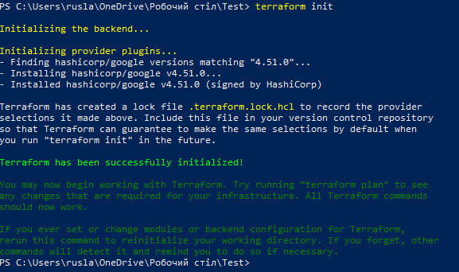
</p>

+ Після чого було застосовано конфігурацію Terraform за допомогою команди:
```
terraform apply
```
+ Результат виводу:

<p align="center">
  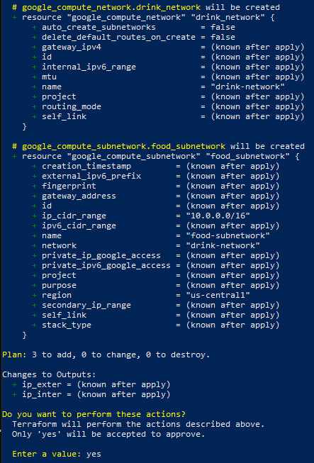
</p>

+ На всі подальші запити відповідаємо "yes" за замовчуванням. 

<p align="center">
  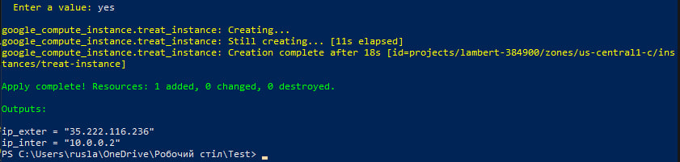
</p>

+ Перевіримо тепер наявність ресурсів в Google Cloud:

<p align="center">
  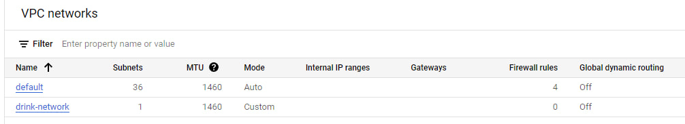
</p>

<p align="center">
  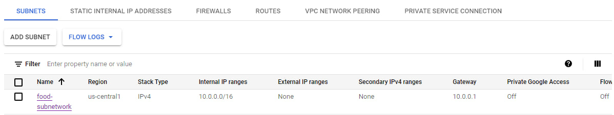
</p>

+ З отриманих даних бачимо, що нам вдалося коректно створити мережу та підмережу. Поглянемо тепер на віртуальну машину та на мережеві мітки: 

<p align="center">
  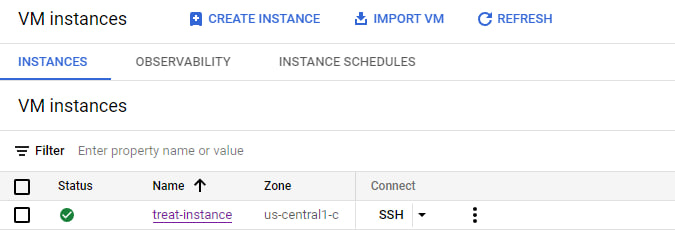
</p>

<p align="center">
  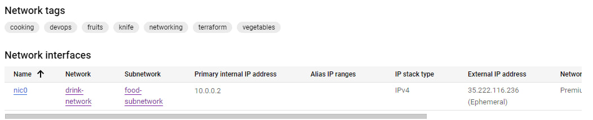
</p>

+ Бачимо, що нам вдалося створити машину та мережу з підмережею коректно. Тож тепер спробуємо знищити усе, що створили до цього. Скористаємося наступною командою:

```
terraform destroy
```

+ Отримаємо наступний вивід у вікні 

<p align="center">
  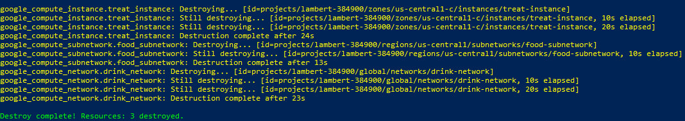
</p>

+ Тепер нам залишається тільки перевірити наявність наших ресурсів в Google Cloud:

<p align="center">
  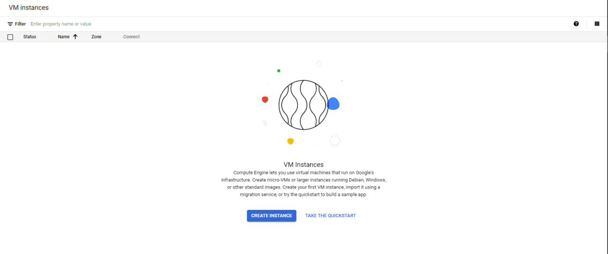
</p>

<p align="center">
  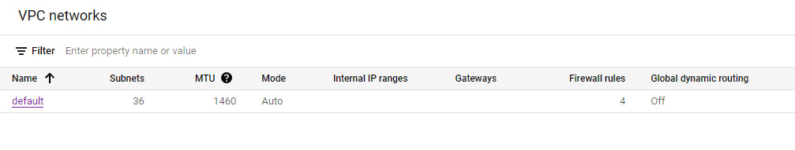
</p>

 Як бачимо, нам вдалося успішно знищити усі ресурси, які були спочатку створені. 

+ Висновок

 В лабораторній роботі було вивчено та опрацьовано можливості роботи з Terraform. Ми переконалися у тому, що за допомогою Terraform-у можливо досить легкими методами спростити деякі процеси, такі як створення мереж, чи віртуальних машин, інсталювання програм та різноманітних додатків. Особливо зручний у випадках, коли потрібно створити саме декілька мереж, чи віртуальних машин. 

 